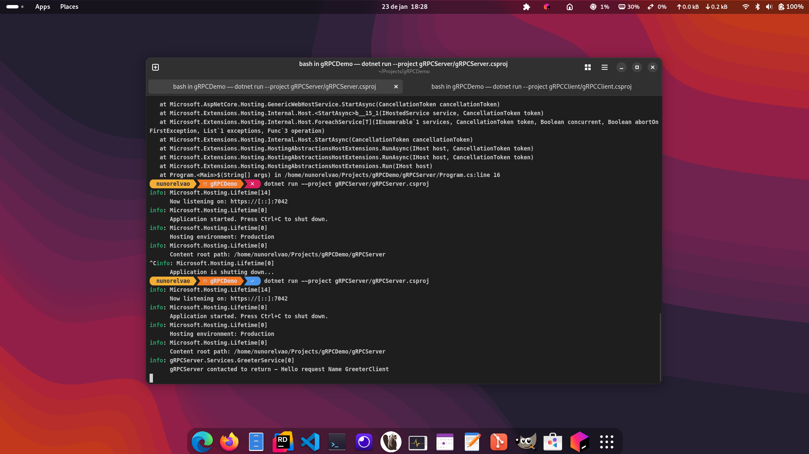

## <pre> gRPC Demo</pre>

####  Nuno Relvao

## Description
- Simple as per dotnet 8.0 template run of a gRPC Server/Client
- The simple idea of gRPC is to be able to remote procedures calls (methods) on another service, kind of as SOAP but in a modern aproach with interop **(proto)** and compressed binary data optipmized instead of XML and schemas of SOAP
- ideally used on microservices or services that need to be called for example by other languages not the same as the server is written on.
- there are expnaded examples of all 4 scenarios available for gRPC 
    - **Unitary** (as a simple API request /response)
    - **Server Stream** (a simple API request / multiple responses on server streaming to client until canceled or server decides to stop)
    - **Client Stream** (many client requests / one response final from server, unless canceled by client, although each client call processes on server as soon as received)
    - **Bidirectional Stream** (many client requests / many responses from server, unless canceled by client or server, each client call processes on server as soon as received and returns back to client as soon as ready as well not having to wait for each other)

# To Run Server (need to be first)
 - Go to where the Solution root folder
 - Run command:  ``` ddotnet run --project gRPCServer/gRPCServer.csproj ```.
 - Please note it is running on **https** so **ssl** is needed (intructiosn as of this running on Fedora Workstation can be seen on this [link](https://fedoramagazine.org/set-up-a-net-development-environment/))

 To Run Client (only after Server running and exposing port 7043)
 - Go to where the Solution root folder
 - Run command:  ``` dotnet run --project gRPCClient/gRPCClient.csproj ```.

## PREVIEW OF RUNNING SERVER



## PREVIEW OF RUNNING CLIENT


## PREVIEW OF CALLING GRPC IN INSOMNIA


[ Insomnia Collection](./resources/Insomnia_2025-01-24.json)

Usefull Link: https://binodmahto.medium.com/streaming-with-grpc-on-net-34a57be520a1

<style>
.filter-svg {
    filter : invert(48%) sepia(79%) saturate(2476%) hue-rotate(86deg) brightness(118%) contrast(119%);
    margin: 0px 10px -5px 0;
}

</style>